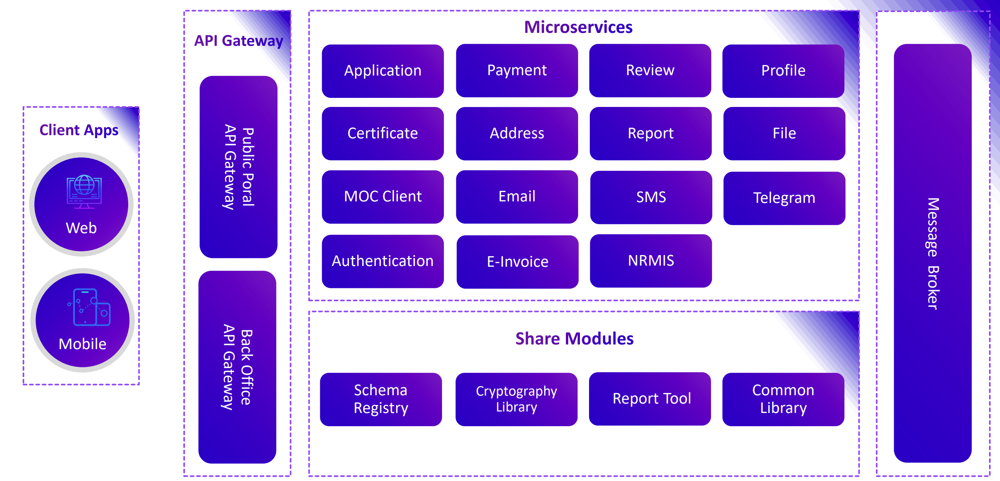
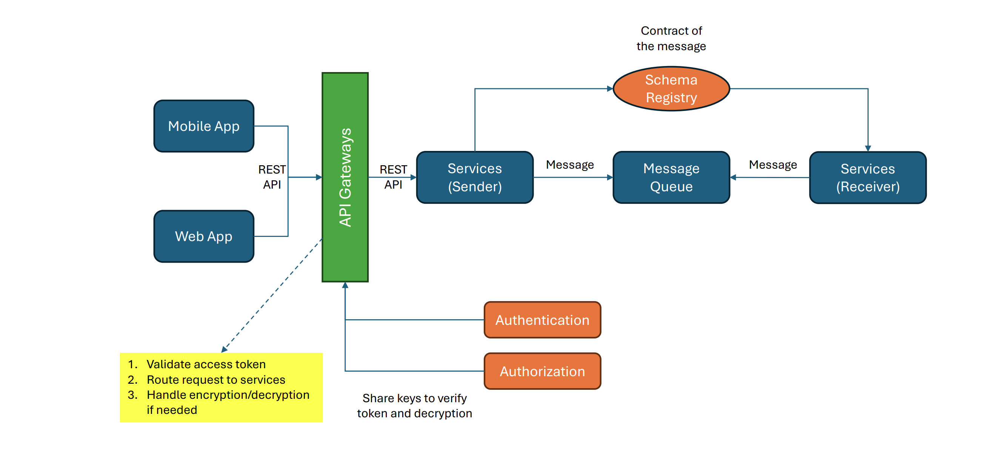
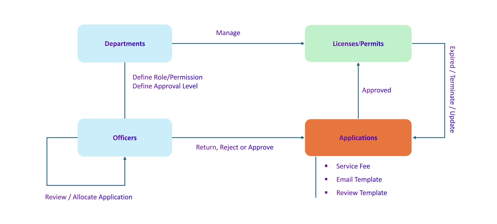

# MCFA E-Services System Overview

Version 2.0.0

The MCFA E-Services System is the Ministry of Culture and Fine Arts (MCFA) implementation of the E-Services for Business (ESB) platform, delivering the ministry's film and video industry licensing services online: production, import-export/distribution, sound-recording and image-editing studios, cinemas, and film-equipment supply.

It is built on the ESB Generic Template, the open-source government service framework developed under the E-Services for Business (ESB) Strategy 2025–2028 (https://digitaleconomy.gov.kh/api/media/file/oqMUiJX2V41qPhckGHs5N1wQZ9ubTib2SH9BuORd.pdf?inline=true). The ESB Strategy aims to digitally enable 80% of high-priority public services by 2028 through shared government portals and platforms. Rather than building each ministry service from scratch, MCFA adopts and customizes the shared template, which provides the common building blocks (application submission, review and approval, payment, notification, certificate issuance, and reporting) so the ministry can focus on its own policy and service-specific requirements.

------------------------------------------------------------------------

## About the ESB Generic Template

The ESB Generic Template is an open-source government service framework designed as a shared codebase that ESB government partners can adopt, customize, and continuously develop to manage and operate their ministry's e-services. It reduces duplication and accelerates the digital transformation of public services across sectors.

The platform provides a standardized yet flexible workflow foundation, including review and approval workflows, payment processing, notifications, certificate generation, reporting, and access control. By offering these common building blocks out of the box, ministries are not required to rebuild core service logic from scratch for each new digital service.

MCFA's deployment tailors this template to the film and video licensing domain: its own service catalogue, licence fees (Joint Prakas 657), certificates, and decision letters, while reusing the template's shared workflow, payment, and notification foundation.

## System Architecture



The backend follows a microservice architecture, where each core business capability is an independent service with its own codebase, database, and deployment lifecycle. This enables:

- Independent scaling and deployment
- Clear ownership per service
- Fault isolation and higher system resilience
- Easier integration with legacy and external systems
- Long-term extensibility without platform lock-in

All backend services communicate via secure APIs and are exposed through centralized gateways.

## Architecture Design Principles



## System Workflow and Logical Design



The system follows a code-based, customizable service lifecycle covering application submission, validation, review and approval, payment, notification, certificate issuance, and reporting. It also supports the full certificate lifecycle: validity management, expiration, renewal or extension, suspension, and termination.

This logical design keeps service behavior consistent while remaining configurable through code and service configuration to meet MCFA's regulatory, policy, and operational requirements.

## Installation Guides

### 1. Backend System Installation Guide

```properties
https://github.com/GDDE-ESB-MOCFA/ESB-Documents/blob/main/backend_system_installation_guide.md
```
🔗 **[Open Backend System Installation Guide](https://github.com/GDDE-ESB-MOCFA/ESB-Documents/blob/main/backend_system_installation_guide.md)**

### 2. Backoffice Portal Installation Guide

```properties
https://github.com/GDDE-ESB-MOCFA/ESB-Documents/blob/main/backoffice_portal_installation_guide.md
```
🔗 **[Open Backoffice Portal Installation Guide](https://github.com/GDDE-ESB-MOCFA/ESB-Documents/blob/main/backoffice_portal_installation_guide.md)**

### 3. Public Portal Installation Guide

```properties
https://github.com/GDDE-ESB-MOCFA/ESB-Documents/blob/main/public_portal_installation_guide.md
```
🔗 **[Open Public Portal Installation Guide](https://github.com/GDDE-ESB-MOCFA/ESB-Documents/blob/main/public_portal_installation_guide.md)**

## Repository Structure Overview

All repositories live under the **GDDE-ESB-MOCFA** GitHub organization. Several backend services have been rewritten on NestJS (the `*-svc-nest` and `*-gateway-nest` repositories); the remaining services run on Spring Boot (Java 21).

## 1. Backend System Repositories

### 1.1. esb-public-gateway-nest

Central API gateway for all public-facing services. Handles JWT verification, request routing, rate limiting, and timeouts for secure, scalable access by citizens and businesses.

```properties
https://github.com/GDDE-ESB-MOCFA/esb-public-gateway-nest.git
```
🔗 **[Open esb-public-gateway-nest Repository](https://github.com/GDDE-ESB-MOCFA/esb-public-gateway-nest.git)**

### 1.2. esb-backoffice-gateway-nest

API gateway for administrative and internal systems. Manages secure internal service routing, access control, and audit logging for backoffice operations.

```properties
https://github.com/GDDE-ESB-MOCFA/esb-backoffice-gateway-nest.git
```
🔗 **[Open esb-backoffice-gateway-nest Repository](https://github.com/GDDE-ESB-MOCFA/esb-backoffice-gateway-nest.git)**

### 1.3. esb-registry-svc-nest

Core registration service. Manages the full lifecycle of service applications (submission, documents, status tracking, service configuration) together with business profiles and licence information. Owns the application, profile, and MCFA film-licensing flows, and publishes licence-operation events consumed by the certificate service.

```properties
https://github.com/GDDE-ESB-MOCFA/esb-registry-svc-nest.git
```
🔗 **[Open esb-registry-svc-nest Repository](https://github.com/GDDE-ESB-MOCFA/esb-registry-svc-nest.git)**

### 1.4. esb-certificate-svc-nest

Generates and manages official licence documents (certificates and decision letters) from approved applications, keyed by service code. Supports document templates, QR code generation, and verification through Verify.gov.kh.

```properties
https://github.com/GDDE-ESB-MOCFA/esb-certificate-svc-nest.git
```
🔗 **[Open esb-certificate-svc-nest Repository](https://github.com/GDDE-ESB-MOCFA/esb-certificate-svc-nest.git)**

### 1.5. esb-review-svc-nest

Implements configurable application review and approval workflows. Supports multi-stage reviews, reviewer assignment, tracking, and automated notifications throughout the review process.

```properties
https://github.com/GDDE-ESB-MOCFA/esb-review-svc-nest.git
```
🔗 **[Open esb-review-svc-nest Repository](https://github.com/GDDE-ESB-MOCFA/esb-review-svc-nest.git)**

### 1.6. ESB-Authorization

Handles user authentication and authorization using role-based access control (RBAC). Manages users, roles, permissions, CamDigiKey login, and access tokens to enforce secure access across the platform.

```properties
https://github.com/GDDE-ESB-MOCFA/ESB-Authorization.git
```
🔗 **[Open ESB-Authorization Repository](https://github.com/GDDE-ESB-MOCFA/ESB-Authorization.git)**

### 1.7. ESB-Payment

Handles licence fees, payment methods, invoices, and transactions, including bank gateway integration. Seeds MCFA licence fees (Joint Prakas 657) per service.

```properties
https://github.com/GDDE-ESB-MOCFA/ESB-Payment.git
```
🔗 **[Open ESB-Payment Repository](https://github.com/GDDE-ESB-MOCFA/ESB-Payment.git)**

### 1.8. ESB-MOC-Client

Provides integration with Ministry of Commerce systems. Enables business registration lookup, identity validation via CamDigiKey, and secure data exchange with MOC platforms.

```properties
https://github.com/GDDE-ESB-MOCFA/ESB-MOC-Client.git
```
🔗 **[Open ESB-MOC-Client Repository](https://github.com/GDDE-ESB-MOCFA/ESB-MOC-Client.git)**

### 1.9. ESB-NRMIS

Provides integration with the NRMIS system for tax and revenue exchange used in the licensing workflow.

```properties
https://github.com/GDDE-ESB-MOCFA/ESB-NRMIS.git
```
🔗 **[Open ESB-NRMIS Repository](https://github.com/GDDE-ESB-MOCFA/ESB-NRMIS.git)**

### 1.10. ESB-Report

Aggregates and manages reporting data across services. Supports dashboards, operational reports, and analytics for monitoring service performance and usage.

```properties
https://github.com/GDDE-ESB-MOCFA/ESB-Report.git
```
🔗 **[Open ESB-Report Repository](https://github.com/GDDE-ESB-MOCFA/ESB-Report.git)**

### 1.11. ESB-Address

Provides standardized reference data for administrative addresses (country, province, district, commune, village), ensuring consistent address usage and validation across all services.

```properties
https://github.com/GDDE-ESB-MOCFA/ESB-Address.git
```
🔗 **[Open ESB-Address Repository](https://github.com/GDDE-ESB-MOCFA/ESB-Address.git)**

### 1.12. ESB-Sms

Delivers SMS notifications for service updates and system events. Manages provider integration, message delivery, and delivery status tracking.

```properties
https://github.com/GDDE-ESB-MOCFA/ESB-Sms.git
```
🔗 **[Open ESB-Sms Repository](https://github.com/GDDE-ESB-MOCFA/ESB-Sms.git)**

### 1.13. ESB-Telegram

Enables Telegram-based notifications and alerts. Supports bot integration, group messaging, and interactive notifications for operational and review workflows.

```properties
https://github.com/GDDE-ESB-MOCFA/ESB-Telegram.git
```
🔗 **[Open ESB-Telegram Repository](https://github.com/GDDE-ESB-MOCFA/ESB-Telegram.git)**

### 1.14. ESB-Email

Handles email notification delivery and configuration. Manages email templates and integrates with approved email providers for reliable communication.

```properties
https://github.com/GDDE-ESB-MOCFA/ESB-Email.git
```
🔗 **[Open ESB-Email Repository](https://github.com/GDDE-ESB-MOCFA/ESB-Email.git)**

## 2. Frontend Application Repositories

### 2.1 ESB-Registry-Public-Portal

Public-facing web interface for businesses and citizens to discover services, submit applications, track status, make payments, and download digital certificates.

```properties
https://github.com/GDDE-ESB-MOCFA/ESB-Registry-Public-Portal.git
```
🔗 **[Open ESB-Registry-Public-Portal Repository](https://github.com/GDDE-ESB-MOCFA/ESB-Registry-Public-Portal.git)**

### 2.2 ESB-Registry-Backoffice-Portal

Administrative web interface for government officials to review applications, manage users and roles, configure services, and access reports and system settings.

```properties
https://github.com/GDDE-ESB-MOCFA/ESB-Registry-Backoffice-Portal.git
```
🔗 **[Open ESB-Registry-Backoffice-Portal Repository](https://github.com/GDDE-ESB-MOCFA/ESB-Registry-Backoffice-Portal.git)**
